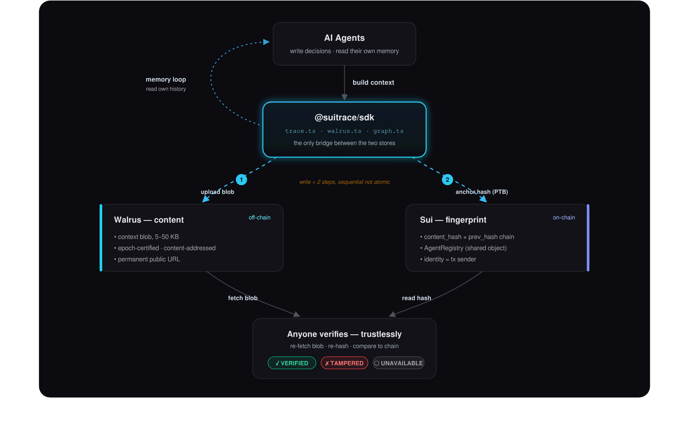

# SuiTrace

**Verifiable episodic memory for AI agents on Sui + Walrus.**

### 🟢 Live on Sui testnet

| | |
|---|---|
| Package | `0xc99c1f17142086ddc3ecfc04bda67660ba96f1d3c85ea1b05911fdaf80984038` |
| AgentRegistry (shared) | `0xd4aeb1b24182906151ac00ad5485c8de18865bb9ef34a5e323331e5d7fdfa327` |
| Demo agent | `0x9e7a2c08cfcd35e83171bf61bb15d04800f516f746f4cb1e5ac802759a090025` |

Two real decisions are recorded (`HOLD` → memory-informed `BUY`). Verify from the CLI:
`tsx scripts/verify.ts 0x9e7a2c08cfcd35e83171bf61bb15d04800f516f746f4cb1e5ac802759a090025`
→ `CHAIN INTEGRITY: PASS`. Or run the UI and open `/0x9e7a2c08…`.

> A DAO agent manages $50K in treasury funds. The DAO votes to audit it. Without
> SuiTrace, the operator controls the logs — they can delete, alter, or fabricate
> the agent's reasoning. There is no independent record of what the agent saw or
> decided.
>
> With SuiTrace, every decision is permanently recorded. The full context — the
> oracle data it read, the prior decisions it considered, the output it produced —
> lives as a Walrus blob: epoch-certified, content-addressed, retrievable by
> anyone at a permanent URL. The on-chain record holds only the hash and the
> signature. The operator cannot alter the blob without breaking the hash, or
> backdate it without breaking the epoch certificate.
>
> Crucially: **the agent itself uses this memory.** At the start of each session it
> fetches its own decision history from Walrus as context. The same blobs that make
> it auditable make it smarter. Memory and auditability are the same system.

DocuSign controls your signed documents. SuiTrace removes the operator's control
over your AI agent's decision history.

*Sui Overflow 2026 — Walrus track.*

---

## How it works

Walrus stores the content. Sui stores the fingerprint. They are linked by a hash
no operator can forge.

1. **Write to Walrus** — the full decision context (prompt, oracle data, prior
   memory, tool results; 5–50 KB) is uploaded to Walrus as an epoch-certified,
   content-addressed blob.
2. **Anchor on Sui** — a SHA-256 of the blob plus a link to the previous decision
   is committed on-chain via a programmable transaction. The contract enforces the
   hash chain and sequence; identity is `tx_context::sender()`.
3. **Verify trustlessly** — anyone re-fetches the blob, re-hashes it, and compares
   to the on-chain record. Match → VERIFIED. Mismatch → TAMPERED. Blob offline →
   CONTEXT UNAVAILABLE (never confused with tampering).

**The memory loop:** at session start an agent calls `fetchDecisionChain` and feeds
its own history into the prompt — making better decisions over time.

> **Write atomicity:** SuiTrace uses a two-step write — upload the context blob to
> Walrus over HTTP, then commit the record anchor to Sui via a PTB. These steps are
> **sequential, not atomic.** If the PTB fails after a successful upload, the blob
> exists on Walrus but is not anchored on Sui.

## Architecture



<sub>Source: [`client/public/architecture.svg`](client/public/architecture.svg) — also rendered live on the site's landing page. ([`docs/architecture.svg`](docs/architecture.svg) is a copy; the PNG above is re-rendered from it.)</sub>

**The seam:** the contract and Walrus never talk to each other — the SDK is the only bridge. Sui stores the fingerprint (`content_hash`), Walrus stores the content, and anyone can re-fetch + re-hash to verify the two still agree. Cross-agent `derived_from` references turn many agents' chains into one traversable provenance graph.

## Why Walrus, specifically

- **Built for large blobs.** Decision context is 5–50 KB; on-chain storage is
  prohibitive. Walrus is designed for exactly this.
- **Epoch certification.** Proves *when* a blob existed — you cannot fake that an
  agent knew something after the fact.
- **Content-addressed.** The blob ID derives from the bytes; altering one byte
  breaks the hash. Tampering is mathematically detectable.
- **Permanent public URLs.** Any verifier can fetch any context years later from
  the public aggregator, independent of SuiTrace ever existing.

---

## Repo layout

```
contracts/        Move package — AgentRegistry + record_decision (11 tests)
sdk/              TypeScript SDK — Walrus client + write/read/verify (16 tests)
scripts/          demo-agent.ts (2-session demo) · verify.ts (CLI verifier)
                  smoke-walrus.ts · deploy.sh
client/           Next.js 16 web UI — landing, agent history, decision detail,
                  /developers guide
```

## Add SuiTrace to an agent (~10 lines)

No registration, no permission step — the registry is a shared on-chain object and
your keypair is your identity.

```ts
import { fetchDecisionChain, recordDecision } from "@suitrace/sdk";

// Session start — read your own history back from Walrus (memory).
const history = await fetchDecisionChain(client, agentAddress);

// ...agent decides using history as context...

// Record the decision — uploaded to Walrus, hash anchored on Sui (audit).
const prev = history.at(-1) ?? null;
await recordDecision(client, signer, {
  agentAddress, seqNum: history.length,
  context, decision, summary,
  prevBlobId: prev?.blobId ?? null,
  prevHash:   prev?.contentHash ?? null,
});
```

Full guide: the `/developers` page in the web app.

---

## Quickstart

### Contract

```bash
cd contracts
sui move build
sui move test          # 11/11 pass
```

### SDK

```bash
cd sdk
pnpm install
pnpm test              # 16/16 pass
```

### Run the full stack on a local Sui network (no testnet gas needed)

```bash
# 1. Start a local network with a faucet
sui start --force-regenesis --with-faucet

# 2. Fund the deployer
sui client switch --env local
curl -s -X POST http://127.0.0.1:9123/gas -H "Content-Type: application/json" \
  -d "{\"FixedAmountRequest\":{\"recipient\":\"$(sui client active-address)\"}}"

# 3. Publish (note PACKAGE_ID and the AgentRegistry object id from the output)
cd contracts && sui client test-publish --build-env testnet --gas-budget 200000000 --json

# 4. Configure .env at the repo root
#    SUITRACE_PACKAGE_ID, SUITRACE_REGISTRY_ID,
#    AGENT_PRIVATE_KEY (sui keytool export --key-identity <addr> --json),
#    SUI_RPC_URL=http://127.0.0.1:9000, SUI_NETWORK=localnet

# 5. Two-session demo — session 2 reads session 1 from Walrus and decides differently
set -a; . ./.env; set +a
pnpm demo              # session 1 -> HOLD
pnpm demo              # session 2 -> BUY (memory-informed)

# 6. Verify any agent's chain from the CLI
tsx scripts/verify.ts <agentAddress>   # -> CHAIN INTEGRITY: PASS
```

Walrus uploads always use Walrus testnet over HTTP, so the local network exercises
the complete write → Walrus → Sui → read → verify path. To deploy to **Sui testnet**
instead, fund the address at https://faucet.sui.io, run `./scripts/deploy.sh`, and
drop the `SUI_RPC_URL`/`SUI_NETWORK` overrides.

### Web UI

```bash
cd client
pnpm install
# point at your deployment:
SUITRACE_REGISTRY_ID=0x... SUI_RPC_URL=http://127.0.0.1:9000 SUI_NETWORK=localnet pnpm dev
```

Open `/<AGENT_ADDRESS>` to browse a decision history, click **Re-verify integrity**
for a live PASS/FAIL/UNREACHABLE check, and open any decision for the full Walrus
blob with a VERIFIED / TAMPERED / CONTEXT UNAVAILABLE badge. The home page links the
live testnet agents (single-agent + the multi-agent network) plus `/demo-tampered`
and `/demo-offline` — simulations of the two states that can't exist as real on-chain
data (a blob can't be altered after its hash is anchored, nor made unreachable on demand).

---
